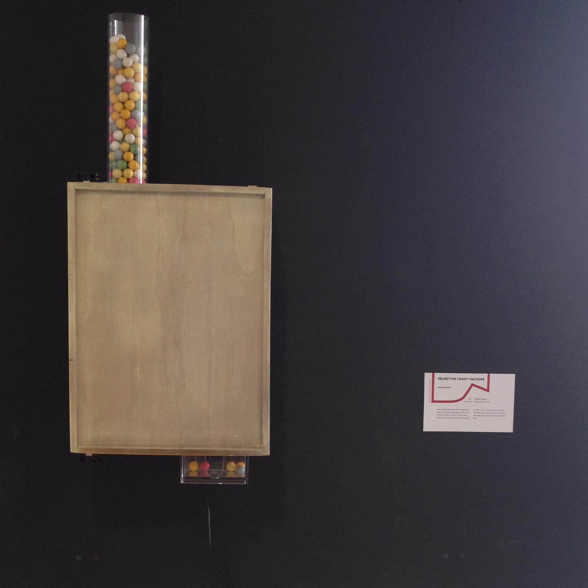
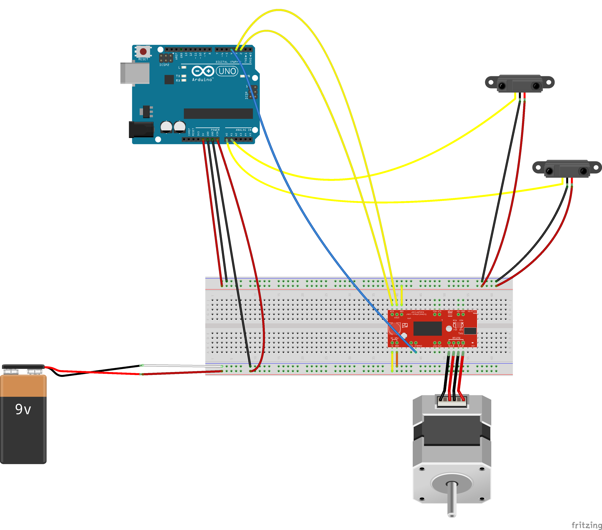

# selective candy machine

This candy machine is different.
Not everyone will get a sweet.
Instead of a coin slot there are 2 infrared sensors and a little bit of code. So the machine decides whom to offer something.
The human input is passive. But once you know which parameters are important, the input can become active. Playfully people will lern, that candies will be given to children and denied to adults. 
Since everyone of us should preserve its inner child, the machine can be outsmarted :)
Just put yourselve to the same eye level as a child...
####[Prototyp](https://vimeo.com/143316854)
####[Candy movie](https://vimeo.com/143266239)
First of all, I wanted to use a camera to have a variety of parameters to work with. If I had had more time an more coding skills ;) I would have used colordetection or object recognition to realize my project.
I tried it, but it didn't worked out. So I decided to employ infrared sensors. These sensors are detecting in to a distance of 30 cm.
Once the lower sensor is triggered, the motor gets a signal to turn 180° and the machine will dispense a candy.
If a tall person is in front of the machine, both sensors will be triggered. The motor won't turn and no candy will be provided.


## You'll need
- Arduino Uno
- 2 Sharp GP2 Y0A41 SK0F distance sensor 30 cm
- 12V power supply
- stepper motor
- Schmalzhaus easy driver
- a lot of Candy

##Fritzing



##THE MACHINE


##code
```python
#define ir1 A0
#define ir2 A1
#define CLOCKDIR_PIN 2
#define CLOCKSTEP_PIN 3

#define ENABLE 4

bool candy_dropped = false; // ist gerade ein candy gefallen, zuerst NEIN

int ir_mem[2][10]; // messuarements for ir average 
int m = 10; //messuarement values of ir_mem

int d_smooth = 0;

int d = 0;

int CLOCKDIR = LOW;
float CLOCKSPEED = 0.03;

//speed is any number from .01 -> 1 with 1 being fastest - Slower is stronger,
//the clock stepper works from 0.00000001 to 0,4 with external power, 0,1-0,2 with battery/usb


bool oben, unten = false;

void setup () {
        Serial.begin (9600);
        pinMode(ir1, INPUT);
        pinMode(ir2, INPUT);
        pinMode(CLOCKDIR_PIN, OUTPUT);//hier stepper initalisierung
        pinMode(CLOCKSTEP_PIN, OUTPUT);
        
        //enable pin, damit der schmalzhaus aus ist und nur bei CANDY befeuert wird.
        pinMode(ENABLE, OUTPUT);
        digitalWrite(ENABLE, HIGH);   //HIGH = alles aus!; LOW = alles an!  
}

void loop () {
      sensorReq();
      
}

void sensorReq () {
      delay (25); //Zeit zwischen den Messungen
      
      int smooth_d1 = smooth_ir(0);
      Serial.print("smooth_d1=");
      Serial.println(smooth_d1);
      
      int smooth_d2 = smooth_ir(1);
      Serial.print("smooth_d2=");
      Serial.println(smooth_d2);
      
      //d1 ist der untere Sensor und sitzt auf A0
      if(smooth_d1 <= 40){
          unten = true;
      }else{
          unten = false;
      }
      
      //d2 ist der obere Sensor und sitzt auf A1
      if(smooth_d2 <= 40){
          oben = true;
      }else{
          oben = false;
      }
      
      if(unten && !oben && !candy_dropped){
          Serial.println("CANDY CANDY CANDY!!!!!");
          candy_dropped = true;
          motorMotion(); 
      }else{
          candy_dropped = false;
      }
}

void motorMotion () {
     digitalWrite(ENABLE, LOW);
     Serial.println("Motor ON");
     rotate(192, CLOCKSPEED, LOW, CLOCKDIR_PIN, CLOCKSTEP_PIN);
     delay(5000); //Pause zwischen Candyausgabe
     digitalWrite(ENABLE, HIGH);
     Serial.println("Motor OFF"); 
}

//return distance (cm)
int get_IR (uint16_t value) {
        if (value < 16)  value = 16;
        return int(2076.0 / (value - 11.0));
}


/*
smooth_ir

require
int array ir_mem[] (array storage for the messuarement values)
int m (amount of values in ir_mem[])

return
int smooth_d (average from m values)

*/
int smooth_ir(int id)
{
   //reset d_smooth
   int d_smooth = 0;
  
   //update ir_mem
   for (int i = 0; i <= m-1; i++) {
     //shift value
     if(i < m-1){
       ir_mem[id][i] = ir_mem[id][i+1];
       
       Serial.print(ir_mem[id][i]);  //debuggatory
       Serial.print(" ");          //debuggatory
     }
     //add new value
     else{
       
       if(id == 1){
         uint16_t value = analogRead (ir2);
         d = get_IR (value); //Convert the analog voltage to the distance
       }else{
         uint16_t value = analogRead (ir1);
         d = get_IR (value); //Convert the analog voltage to the distance
       }
       
     Serial.print("ir ID=");
     Serial.print(id);
       
       ir_mem[id][i] = d;
       //Serial.print(ir_mem[i]);  //debuggatory
     }
     //cumulate values from new ir_mem Array
     d_smooth = d_smooth + ir_mem[id][i];

   }
   //average from d_smooth cumulation and messuarments amounts
   d_smooth = int(d_smooth / m);
   return d_smooth;
}

void rotate(int steps, float speed, int dir, int DIR_PIN, int STEP_PIN) {
  //rotate a specific number of microsteps (8 microsteps per step) - (negative for reverse movement)


  digitalWrite(DIR_PIN, dir);

  float usDelay = (1 / speed) * 70;

  for (int i = 0; i < steps; i++) {

    digitalWrite(STEP_PIN, HIGH);
    delayMicroseconds(usDelay);

    digitalWrite(STEP_PIN, LOW);
    delayMicroseconds(usDelay);
  }
}


```


###License

The MIT License (MIT)

Copyright (c) 2015 Rosaplankton

Permission is hereby granted, free of charge, to any person obtaining a copy
of this software and associated documentation files (the "Software"), to deal
in the Software without restriction, including without limitation the rights
to use, copy, modify, merge, publish, distribute, sublicense, and/or sell
copies of the Software, and to permit persons to whom the Software is
furnished to do so, subject to the following conditions:

The above copyright notice and this permission notice shall be included in
all copies or substantial portions of the Software.

THE SOFTWARE IS PROVIDED "AS IS", WITHOUT WARRANTY OF ANY KIND, EXPRESS OR
IMPLIED, INCLUDING BUT NOT LIMITED TO THE WARRANTIES OF MERCHANTABILITY,
FITNESS FOR A PARTICULAR PURPOSE AND NONINFRINGEMENT. IN NO EVENT SHALL THE
AUTHORS OR COPYRIGHT HOLDERS BE LIABLE FOR ANY CLAIM, DAMAGES OR OTHER
LIABILITY, WHETHER IN AN ACTION OF CONTRACT, TORT OR OTHERWISE, ARISING FROM,
OUT OF OR IN CONNECTION WITH THE SOFTWARE OR THE USE OR OTHER DEALINGS IN
THE SOFTWARE.
